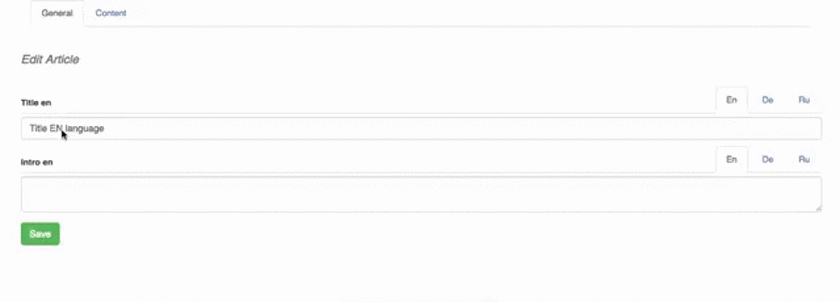

# Multilang Field Wrapper

This gem improves standard input fields , it adds filed for all the languages
​​with which you can easily edit all translations at once.

#### It allows:

* Submit form with all translations at once
* Use this inputs with nested attributes

### Dependencies

```ruby
gem 'globalize', '~> 5.0.0'
```

### Install

```ruby
gem 'multilang_field', github: 'kelevro/multilang_field'
```

### Run generator

```console
$ bundle install
$ rails g multilang_field:install
```

### Edit template

`views/multilang_field/_wrapper.html.erb` in your project use for wrapped field.
Edit this file for customize.


### Configure
initializer `multilang_field.rb`

```ruby
MultilangField.configure do |config|
  config.language_list    = -> { {en: '/english.png', ru: '/russian.png'} }
end
```

 - language_list (optional) - hash images for locales. Where key - locale, value - image path


### Example:

```ruby
class ArticlesController < ApplicationController
  def article_params
    attrs = [translations_attributes: [:id, :locale, :title, :description]]
    params.require(:article).permit(*attrs)
  end
end

class Article < ActiveRecord::Base
  translates :title, :description, fallbacks_for_empty_translations: true
  accepts_nested_attributes_for :translations

  #validations
  class Translation
    validates :description, presence: true
  end
end
```

```erb
<%= form_for @article do |form| %>
  <%= multilang_wrapper(form, :title) { |attribute, label| form.input(attribute, label: label) } %>
<% end %>
```




## TODO
  * TDD
  * Cut out bootstrap


This project rocks and uses MIT-LICENSE.
